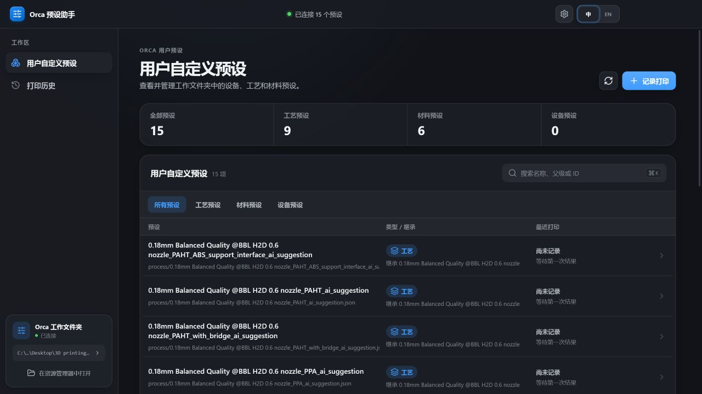
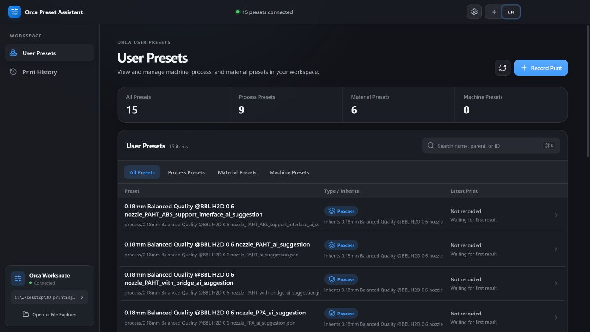

# Orca Preset Assistant

[中文](#readme-zh-cn) · [English](#readme-en)

<a id="readme-zh-cn"></a>

## 中文

Orca Preset Assistant 是嵌入 OrcaSlicer 主窗口的用户预设与打印历史工作台。日常使用只需要 Orca 和 Codex 两个窗口：Orca 继续负责模型、切片、设备和打印，助手面板负责预设审阅、受控写入与打印结果归档。

> 当前状态：Windows 早期预览版。核心流程和自动化测试已经建立，真实打印、不同显示缩放和 Orca 升级兼容仍需持续验证。[v0.5.0 Release](https://github.com/Siegfried19/OrcaPresetAssistant/releases/tag/v0.5.0) 提供独立便携面板；完整日常体验仍需使用带原生集成的定制 Orca 构建。



### 产品范围

面板只有两个一级页面：

- **用户自定义预设**：查看 machine、process、filament 用户预设，审阅 Codex 参数提案，并明确选择写入位置。
- **打印历史**：自动或手动保存打印档案，记录实际有效参数，并在打印后补写结果和备注。

首次使用时选择一个工作文件夹。程序只管理下面两个子文件夹：

```text
<Workspace>\
├─ UserPresets\
│  ├─ machine\
│  ├─ process\
│  └─ filament\
└─ PrintHistory\
```

官方 Orca 预设继续保留在 Orca 原有位置，不复制、不修改。

### 主要能力

- 在 Orca 内查看当前工作区的三类用户预设。
- 用“Orca 创建/管理”或“本地 JSON”标记预设来源；只有 JSON 的本地预设仍可正常使用。
- 查看逐预设的本地变化；在 `UserPresets` 中启用独立本地版本、保存快照并安全恢复旧版本。
- 让 Codex 按授权级别读取通用状态、当前设置，或当前项目的零件摆放和模型几何。
- 审批参数变化并选择“仅当前项目 / 更新当前永久预设 / 另存为新永久预设”。
- 在没有后续冲突时回滚最近一次 Orca 写入。
- 打印提交成功后自动建档，可选择是否保存当前项目 3MF 副本。
- 打印完成后补写成功、问题、失败和备注。
- Orca 原生标签跟随 Orca 语言；面板内容可独立切换中文或英文。

机器预设目前只读。Codex 自动写入只开放给 Orca 原生层明确验证过的 process / filament 参数白名单。

### 下载与使用

- [下载 Windows x64 便携版](https://github.com/Siegfried19/OrcaPresetAssistant/releases/download/v0.5.0/OrcaPresetAssistant-0.5.0-portable.exe)
- [查看 v0.5.0 发布说明](https://github.com/Siegfried19/OrcaPresetAssistant/releases/tag/v0.5.0)

便携版无需安装，主要用于独立查看面板、连接工作区和故障排查。它不包含整个定制 OrcaSlicer。完整的内嵌面板、当前项目读取、原生三种写入和自动打印建档需要按照[原生补丁说明](./native/orca/README.md)和[打包说明](./native/orca/PACKAGING.md)构建完整版本。

### 安装 Codex 插件

Codex 插件与面板是同一仓库维护的两个组件：面板负责授权和最终写入，插件让 Codex 调用这些受控接口。

从包含插件包的 Release 下载 `OrcaPresetAssistant-Codex-Plugin-<version>.zip`，解压到长期保留的目录后运行：

```powershell
codex plugin marketplace add "<解压后的插件包目录>"
codex plugin add orca-preset-assistant@orca-preset-assistant-release
codex plugin list
```

从源码构建时先运行 `pnpm package:plugin`，再解压 `release` 中生成的插件包。完成安装后新建一个 Codex 任务；在面板标题栏点击 `?` 可随时查看同样的安装步骤、权限说明和示例提问。完整说明见 [Codex 插件安装与使用](./docs/CODEX_PLUGIN.md)。

### Bambu LAN Only 打印

本项目的定制 Orca 没有 Bambu Lab 的应用签名。使用较新打印机固件时，普通授权模式会拒绝它直接发起打印，并可能返回 `-26`。如果你只使用 LAN Only：

1. 在打印机屏幕进入 LAN Only 设置；
2. 开启 LAN Only，并同时手动开启 **Developer Mode**；
3. 回到 Orca，重新连接打印机后再发送打印。

不需要安装 Bambu Connect。Developer Mode 会开放打印机的局域网接口，只应在可信的本地网络中使用；Bambu Lab 也说明该模式需要用户自行承担局域网安全责任。参考 [Bambu Lab 对 Developer Mode 的官方说明](https://blog.bambulab.com/updates-and-third-party-integration-with-bambu-connect/)。

若发送仍显示 `-26`，先确认打印机上的 Developer Mode 仍为开启状态，再在 Orca 中断开并重新连接设备。本项目不会远程开启或关闭打印机的安全设置。

### 权限与隐私

Codex 默认只提供通用建议。用户可按会话选择：

- 不读取当前项目；
- 读取当前预设和有效参数；
- 读取当前项目的零件摆放与 STL/3MF 几何。

模型权限只覆盖当前 Orca 项目实际引用的文件，不扫描最近文件或其他目录。Orca 是项目状态与预设写入的唯一权威来源，面板不会手工生成云同步 `.info` 元数据，也不会直接覆盖官方预设。只有 JSON 的本地预设同样有效，不会因此显示结构异常。

详细边界见[技术规格](./TECHNICAL_SPEC.md)和[架构说明](./docs/ARCHITECTURE.md)。

### 仓库结构

本仓库包含产品需要维护的全部源码，不依赖旧的 Bambu 面板代码库。

```text
src/                         Electron/React 面板、本地 helper 与就地测试
native/orca/                 针对固定 OrcaSlicer 基线的可审阅补丁
plugins/orca-preset-assistant/
                             Codex 插件源码
packaging/codex-marketplace/ Codex Release Marketplace 模板
docs/                        用户、架构、验证与发布文档
```

`FullVersion/`、`release/`、`node_modules/` 和编译输出不会进入 Git。公开二进制通过 GitHub Releases 单独发布，并与对应源码版本关联。

### 本地开发

要求：

- Windows 10/11
- Node.js 22+
- pnpm 11（仓库固定为 `pnpm@11.9.0`）

```powershell
pnpm install --frozen-lockfile
pnpm quality
pnpm dev
```

插件集成测试：

```powershell
node --test `
  plugins/orca-preset-assistant/server/model-inspector.test.mjs `
  plugins/orca-preset-assistant/server/server.test.mjs
```

生成独立 Windows 便携面板：

```powershell
pnpm package:win
```

生成可单独发布的 Codex 插件包：

```powershell
pnpm package:plugin
```

### 文档

- [用户指南](./docs/USER_GUIDE.md)
- [Codex 插件安装与使用](./docs/CODEX_PLUGIN.md)
- [产品计划](./PRODUCT_PLAN.md)
- [技术规格](./TECHNICAL_SPEC.md)
- [验收清单](./ACCEPTANCE.md)
- [当前验证状态](./docs/VALIDATION.md)
- [发布流程](./docs/RELEASING.md)
- [贡献指南](./CONTRIBUTING.md)
- [安全策略](./SECURITY.md)

### 许可证与商标

本仓库以 [GNU Affero General Public License v3.0 only](./LICENSE) 发布。OrcaSlicer 原生集成基于 OrcaSlicer 的 AGPL-3.0 代码与接口，因此整个仓库采用同一许可证，避免把同一产品拆成含混的授权边界。

本项目不是 OrcaSlicer、SoftFever 或 Bambu Lab 的官方产品。相关名称和商标属于各自权利人。第三方依赖继续适用其各自许可证；详见 [NOTICE.md](./NOTICE.md)。

[返回顶部](#orca-preset-assistant)

---

<a id="readme-en"></a>

## English

Orca Preset Assistant is a user-preset and print-history workspace embedded in the OrcaSlicer main window. Daily use requires only two windows: Orca handles models, slicing, devices, and printing, while Codex helps review presets and propose controlled changes.

> Current status: early Windows preview. The core workflows and automated tests are in place, while physical-print validation, display scaling, and compatibility with future Orca upgrades still require ongoing verification. The [v0.5.0 Release](https://github.com/Siegfried19/OrcaPresetAssistant/releases/tag/v0.5.0) provides the standalone portable panel; the complete daily workflow still requires a custom Orca build with the native integration.



### Product scope

The panel has only two top-level pages:

- **User Presets**: inspect machine, process, and filament presets, review Codex proposals, and explicitly choose where a change will be written.
- **Print History**: archive prints automatically or manually, preserve the effective settings, and add results or notes after printing.

On first use, choose one workspace folder. The application manages only these two subdirectories:

```text
<Workspace>\
├─ UserPresets\
│  ├─ machine\
│  ├─ process\
│  └─ filament\
└─ PrintHistory\
```

Official Orca presets remain in their original Orca-managed location. They are neither copied nor modified.

### Key capabilities

- View all three user-preset types from inside Orca.
- Mark each preset as either **Orca Created / Managed** or **Local JSON**. A JSON-only preset remains valid.
- See local changes per preset; initialize independent local versions in `UserPresets`, save snapshots, and safely restore an earlier version.
- Let Codex read general context, current settings, or current-project placement and model geometry according to explicit permission.
- Approve a change only after choosing **Current Project Only**, **Update Current Permanent Preset**, or **Save as New Permanent Preset**.
- Roll back the latest Orca write when no later change conflicts with it.
- Create a print archive after a successful print submission, with an optional current-project 3MF copy.
- Add success, issue, failure, and notes after the physical print finishes.
- Follow Orca's language for the native tab while allowing the panel language to be switched independently.

Machine presets are currently read-only. Automated Codex writes are limited to process and filament parameters that the Orca native layer has explicitly allowlisted and validated.

### Download and use

- [Download the Windows x64 portable build](https://github.com/Siegfried19/OrcaPresetAssistant/releases/download/v0.5.0/OrcaPresetAssistant-0.5.0-portable.exe)
- [Read the v0.5.0 release notes](https://github.com/Siegfried19/OrcaPresetAssistant/releases/tag/v0.5.0)

The portable build requires no installation and is intended for standalone panel review, workspace access, and troubleshooting. It does not include the full custom OrcaSlicer build. The embedded panel, current-project access, three native write destinations, and automatic print archiving require a full build following the [native patch guide](./native/orca/README.md) and [packaging guide](./native/orca/PACKAGING.md).

### Install the Codex plugin

The panel and Codex plugin are two components maintained in this repository: the panel owns permissions and final writes, while the plugin lets Codex call those controlled interfaces.

Download `OrcaPresetAssistant-Codex-Plugin-<version>.zip` from a Release that includes the plugin package, extract it to a permanent directory, and run:

```powershell
codex plugin marketplace add "<extracted plugin package directory>"
codex plugin add orca-preset-assistant@orca-preset-assistant-release
codex plugin list
```

When building from source, run `pnpm package:plugin` first and extract the generated package from `release`. Start a new Codex task after installation. The `?` button in the panel title bar shows the same installation steps, permission scopes, and example prompts. See [Codex plugin installation and usage](./docs/CODEX_PLUGIN.md) for full details.

### Bambu LAN Only printing

This project's custom Orca build does not carry a Bambu Lab application signature. Newer printer firmware may reject direct print requests in the normal authorization mode and return error `-26`. If you use LAN Only:

1. Open the LAN Only settings on the printer display.
2. Enable LAN Only and manually enable **Developer Mode** in the same area.
3. Return to Orca, reconnect the printer, and submit the print again.

Bambu Connect is not required for this route. Developer Mode exposes local-network interfaces and should be enabled only on a trusted LAN. Bambu Lab also states that the user assumes responsibility for local-network security when enabling it. See [Bambu Lab's official Developer Mode explanation](https://blog.bambulab.com/updates-and-third-party-integration-with-bambu-connect/).

If error `-26` remains, confirm that Developer Mode is still enabled, then disconnect and reconnect the device in Orca. This project never enables or disables printer security settings remotely.

### Permissions and privacy

Codex provides general advice by default. For each session, the user can choose to:

- expose no current-project data;
- expose the current presets and effective settings;
- expose current-project part placement and STL/3MF geometry.

Model access covers only files referenced by the currently open Orca project. It does not scan recent files or unrelated directories. Orca is the sole authority for current-project state and preset writes. The panel does not synthesize cloud-sync `.info` metadata or overwrite official presets directly. Local JSON-only presets remain valid and are not reported as structural errors.

See the [technical specification](./TECHNICAL_SPEC.md) and [architecture guide](./docs/ARCHITECTURE.md) for the complete boundaries.

### Repository layout

This repository contains all source maintained for the product and does not depend on the former Bambu dashboard codebase.

```text
src/                         Electron/React panel, local helper, and colocated tests
native/orca/                 Reviewable patches for a pinned OrcaSlicer baseline
plugins/orca-preset-assistant/
                             Codex plugin source
packaging/codex-marketplace/ Codex Release Marketplace template
docs/                        User, architecture, validation, and release documentation
```

`FullVersion/`, `release/`, `node_modules/`, and build outputs are excluded from Git. Public binaries are distributed separately through GitHub Releases and tied to the corresponding source version.

### Local development

Requirements:

- Windows 10/11
- Node.js 22+
- pnpm 11 (pinned to `pnpm@11.9.0`)

```powershell
pnpm install --frozen-lockfile
pnpm quality
pnpm dev
```

Codex plugin integration tests:

```powershell
node --test `
  plugins/orca-preset-assistant/server/model-inspector.test.mjs `
  plugins/orca-preset-assistant/server/server.test.mjs
```

Build the standalone Windows portable panel:

```powershell
pnpm package:win
```

Build the separately distributable Codex plugin package:

```powershell
pnpm package:plugin
```

### Documentation

- [User guide](./docs/USER_GUIDE.md)
- [Codex plugin installation and usage](./docs/CODEX_PLUGIN.md)
- [Product plan](./PRODUCT_PLAN.md)
- [Technical specification](./TECHNICAL_SPEC.md)
- [Acceptance checklist](./ACCEPTANCE.md)
- [Current validation status](./docs/VALIDATION.md)
- [Release process](./docs/RELEASING.md)
- [Contributing guide](./CONTRIBUTING.md)
- [Security policy](./SECURITY.md)

### License and trademarks

This repository is licensed under the [GNU Affero General Public License v3.0 only](./LICENSE). The native OrcaSlicer integration builds on AGPL-3.0 OrcaSlicer code and interfaces, so the repository uses the same license without an ambiguous split between parts of one product.

This is not an official product of OrcaSlicer, SoftFever, or Bambu Lab. Their names and trademarks belong to their respective owners. Third-party dependencies remain subject to their own licenses; see [NOTICE.md](./NOTICE.md).

[Back to top](#orca-preset-assistant)
