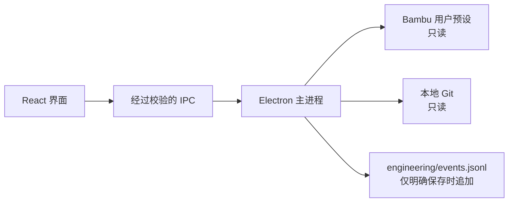

# Bambu Preset Dashboard

> 面向 Bambu Studio 自定义工艺与材料预设的本地工程记录面板。<br>
> A local engineering dashboard for Bambu Studio presets and print evidence.

[中文](#中文) · [English](#english)


## 中文

### 为什么做这个工具

当自定义工艺和材料越来越多，仅靠 Bambu Studio 的预设列表很难快速回答这些问题：

- 我现在有哪些自定义工艺和材料？
- 哪些参数相对上一次 Git 记录发生了变化？
- 最近一次实物打印使用的是不是当前参数版本？
- 某个结论来自实际打印，还是仍然只是待验证假设？

Bambu Preset Dashboard 把预设身份、Git 状态和打印证据放在同一个只读视图中，减少在 Bambu Studio、文件资源管理器、GitHub Desktop 和实验笔记之间来回切换的操作摩擦。

### 主要能力

| 能力       | 说明                                                           |
| ---------- | -------------------------------------------------------------- |
| 预设总览   | 自动读取 `process/`、`filament/` 和 `machine/` 中的用户预设    |
| Git 可见性 | 区分新增、参数修改、仅 Bambu 元数据变化和已同步状态            |
| 结构检查   | 检查文件名、内部名称、settings ID 和配套 `.info` 是否一致      |
| 打印证据   | 一次选择工艺、一个或多个材料、结果与备注，并绑定当时的参数快照 |
| 版本判断   | 参数改变后，自动标记旧打印结果不再对应当前版本                 |
| 中英文界面 | 标题栏一键切换中文 / English，并在本机记住选择                 |
| 即开即用   | 提供 Windows x64 便携版本，无需安装 Node.js 或 Python          |
| 系统主题   | 自动跟随 Windows 的浅色或深色模式                              |

### 快速开始

1. 从 [Releases](../../releases/latest) 下载最新的 `BambuPresetDashboard-*-portable.exe`。
2. 双击运行，无需安装。
3. 应用会自动搜索：

   ```text
   %APPDATA%\BambuStudio\user\*
   ```

4. 如果自动识别失败，在面板左下角选择一次用户预设目录。该路径会保存在应用自己的本地配置中，下次自动连接。

> 软件仓库与预设仓库彼此独立。预设目录不需要固定在软件工程内，也不需要作为 Git submodule。

### 面板如何理解 Git 状态

- **新增**：JSON 还没有纳入当前预设仓库的 Git 历史。
- **已修改**：预设 JSON 相对 `HEAD` 有参数差异，并显示增删行数。
- **元数据**：JSON 没变，只有配套 `.info` 出现 Bambu 生成的身份或同步变化。
- **已同步**：JSON 和 `.info` 均与当前 Git 记录一致。
- **未知**：当前预设目录不是可读取的 Git 仓库。

面板只负责显示状态，不会自动执行 `git add`、commit、push、pull 或 reset。

### 打印记录

只有在用户明确点击“保存打印记录”时，应用才会向所连接的预设仓库追加：

```text
engineering/events.jsonl
```

每一行都是独立的 UTF-8 JSON 事件，包含：

- 打印时间、结果和备注；
- 工艺与材料的相对路径；
- 当时 JSON 文件的 SHA-256；
- 当时的自定义参数快照。

这是追加式记录：后续参数变化或结论修正不会覆盖旧实验。

### 数据与安全边界

- 预设 JSON 和 `.info` 始终只读。
- 不修改 Bambu Studio 的系统预设。
- 不自动提交或推送任何 Git 仓库。
- 不上传预设、打印记录或本地路径到云端。
- 只有保存打印记录是写操作，且目标固定为 `engineering/events.jsonl`。
- Electron 渲染进程不启用 Node.js；桌面能力通过经过校验的窄 IPC 接口提供。



### 当前限制

- 当前提供 Windows x64 便携版本。
- 本版本不直接编辑预设参数。
- 不嵌入或修改 Bambu Studio。
- 不替代切片预览、实物验证或工程变更记录。
- 打印记录由用户主动填写，不会自动读取打印机历史。

### 本地开发

需要 Node.js 22+ 和 pnpm 11。

```powershell
pnpm install
pnpm dev
```

完整质量检查：

```powershell
pnpm quality
```

质量检查包括 TypeScript、ESLint、Prettier 和 Vitest。

生成 Windows 便携版本：

```powershell
pnpm package:win
```

产物位于 `release/`。也可以双击 `build.cmd` 执行相同的检查与打包流程。

### 项目结构

```text
src/
  main/
    application/       用例编排与应用状态
    domain/            预设身份和记录规则
    infrastructure/    文件、Git、Bambu 与配置适配器
    ipc/               经过校验的桌面接口
  preload/             最小权限的 Electron bridge
  renderer/
    src/components/    可复用界面组件
    src/hooks/         界面状态与用例调用
    src/i18n/          类型化的中英文文案与持久化语言状态
    src/styles/        设计 token 和响应式布局
  shared/              主进程与界面共享的契约
```

更完整的边界与扩展约束见 [架构说明](docs/ARCHITECTURE.md)。

### 常见问题

<details>
<summary>预设以后必须放在固定位置吗？</summary>

不需要。应用优先自动识别 Bambu Studio 的用户目录；如果目录被移动，只需手动选择一次。

</details>

<details>
<summary>面板会把自己的修改也显示为“本地修改”吗？</summary>

只要目标预设文件相对预设仓库的 Git `HEAD` 有差异，不论由用户、Bambu Studio 还是其他工具产生，都会显示。软件自身不会改写预设文件。

</details>

<details>
<summary>为什么 `.info` 变化与参数变化分开显示？</summary>

`.info` 常包含 `setting_id`、同步信息和更新时间。它们可能由 Bambu Studio 自动更新，但不一定改变切片行为，因此面板将其标记为“元数据”。

</details>

---

## English

Bambu Preset Dashboard is a local, read-mostly engineering workspace for custom Bambu Studio process, filament, and machine presets.


It answers three practical questions in one view:

- Which custom presets exist, and what official presets do they inherit from?
- Which parameter files differ from the latest local Git record?
- Does the latest physical print still correspond to the current parameter version?

### Highlights

- Automatic discovery of Bambu Studio user preset folders
- Process, material, and machine preset inventory
- Separate Git states for parameter changes and Bambu-only metadata churn
- Preset identity validation for filenames, internal IDs, and matching `.info` files
- Append-only print evidence linked to SHA-256 parameter snapshots
- Persistent Chinese / English interface
- System light and dark themes
- Portable Windows x64 build

### Quick start

1. Download the latest portable executable from [Releases](../../releases/latest).
2. Run it directly; no installer, Node.js, or Python is required.
3. The app normally discovers `%APPDATA%\BambuStudio\user\*` automatically.
4. If discovery fails, choose the preset folder once from the lower-left data-source card.

### Safety guarantees

- Preset JSON and `.info` files remain read-only.
- The app never runs Git staging, commits, pushes, pulls, or resets.
- No preset data or print evidence is uploaded.
- The only intentional write is an explicitly saved event appended to `engineering/events.jsonl`.

### Development

```powershell
pnpm install
pnpm dev
pnpm quality
pnpm package:win
```

See [Architecture](docs/ARCHITECTURE.md) for implementation boundaries and extension guidance.

---

Bambu Studio and Bambu Lab are trademarks of their respective owners. This project is an independent local tool and is not affiliated with or endorsed by Bambu Lab.
